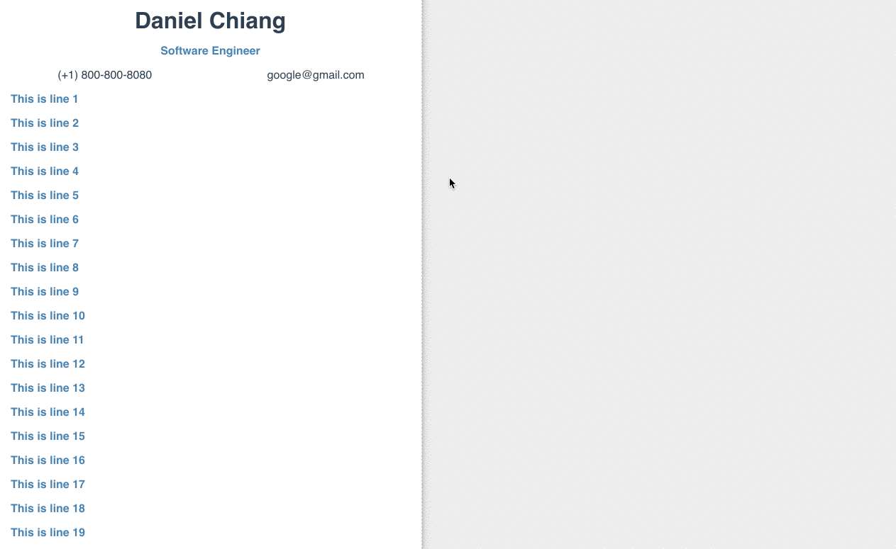

<p align="center">
    
    
</p>

# Vue app to PDF

Format your page with `Vue`, then convert it into `PDF`


## Demo




## Getting started


1. Install dependencies

```bash
npm i
```

2. Start a local developing server

```bash
npm start
```

3. Go to `src/components`, and change/add whatever makes sense to you

4. Happy coding :laughing:


## Prerequisites

### Built With

This repo relies on [NodeJS](https://nodejs.org/), so make sure you have it on your machine.

#### Dependencies

- [Vue](https://github.com/vuejs/vue)@2.5.2
- [Vue-router](https://github.com/vuejs/vue-router)@3.0.1
- [jsPDF](https://github.com/MrRio/jsPDF)@1.3.5
- [html2canvas](https://github.com/niklasvh/html2canvas)@0.5.0-beta4

> Make sure you installed all required dependencies by running `npm i`


## License

[MIT](http://opensource.org/licenses/MIT)

Copyright (c) 2017, Daniel Chiang